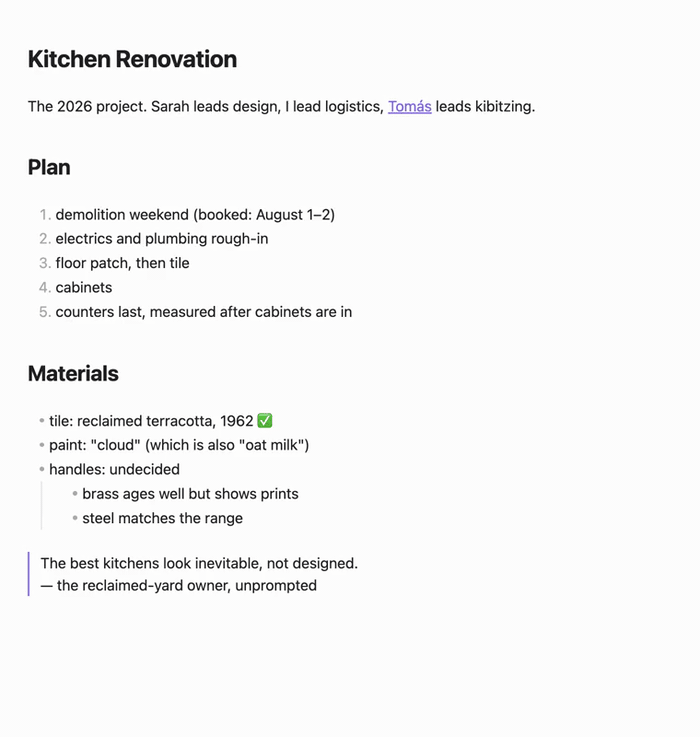

# True Outliner

Edit the structure of any Obsidian note, not just its text. Headings, paragraphs and lists become nodes of one tree that can be indented, moved, split, selected and zoomed as whole units. The file on disk stays plain markdown, byte for byte.

> [!NOTE]
> **Early preview.** Usable today and under active development. Not yet in the community plugin directory, and defaults may still change. The **[website](https://laughedelic.github.io/obsidian-true-outliner/)** has the guide, a live demo, and the [known limitations](https://laughedelic.github.io/obsidian-true-outliner/reference/limitations).

## What it does

- **Any note is an outline.** Every block a note already has, whether heading, paragraph, list item, code block, table or callout, is a node. Nothing to convert, no special note type. Toggle outline mode per tab and the note is stock Obsidian again.
- **Operations work on the tree.** Tab and Shift+Tab move a node with everything under it, wherever the caret is. Headings change level and their section follows. Enter splits a node and ordered lists renumber; Enter on an empty item walks back out of the nesting; Backspace at a node's first character joins it upward. Move up and down swap whole siblings.
- **Selection snaps to nodes.** Shift+Arrow grows a selection one node at a time, Mod+A climbs from the node's text to its subtree, its list, its section, the note. A drag across a boundary snaps outward to whole nodes and is drawn as a block. Delete, Cut, Tab and the move commands act on everything it covers.
- **Fold any branch.** Every node with children folds, headings, list items and paragraphs alike, with a count of what is hidden. A fold follows its node when it moves and is remembered per note without a byte written to the file.
- **Zoom into anything.** Click a marker to show one node and its subtree as the whole note, with a breadcrumb trail back out. Editing is confined to what is visible.
- **Backlinks in their own tree.** Below every note, each reference to it from the vault is shown in the tree of the note it came from: ancestors, the node, its children. Grouped by note, sortable, filterable, one click from the source.
- **Clean files.** No IDs, no fold markers, no metadata. Parsing a note and writing it back is byte-identical, and a structural edit changes the lines it moved and nothing else. Works with every other plugin, tool and sync method.
- **Desktop and mobile**, any theme, built on Obsidian's public APIs only.

## Install

Until the plugin is in the community directory, install it through [BRAT](https://github.com/TfTHacker/obsidian42-brat): **Add beta plugin** → `laughedelic/obsidian-true-outliner`. Or copy `main.js`, `manifest.json` and `styles.css` from the [latest release](https://github.com/laughedelic/obsidian-true-outliner/releases/latest) into `.obsidian/plugins/true-outliner/`. Details in the [installation guide](https://laughedelic.github.io/obsidian-true-outliner/guide/installation).

Obsidian 1.5.0 or later. If the **Outliner** or **Zoom** community plugin is enabled in the same vault, disable one of them: they bind the same keys.

## Learn more

- [Getting started](https://laughedelic.github.io/obsidian-true-outliner/guide/getting-started), five minutes with any note, with a live editor to try the keys in
- [How a note becomes an outline](https://laughedelic.github.io/obsidian-true-outliner/guide/how-notes-become-outlines), the mapping behind everything, and the two rules that surprise people
- [Settings](https://laughedelic.github.io/obsidian-true-outliner/reference/settings) and [commands and keys](https://laughedelic.github.io/obsidian-true-outliner/reference/commands-and-keys)
- [Compared to other outliners](https://laughedelic.github.io/obsidian-true-outliner/guide/compared): Workflowy, Roam, Logseq, Tana, outl, org-mode, and the existing Obsidian plugins

## Why

Outliner apps such as Workflowy, Roam, Logseq and Tana share one invariant: the document is a tree of nodes, and every operation respects node boundaries. Obsidian's markdown lists have no such invariant, and the plugins that add outliner keybindings work on flat text, so a move works only when the caret is in the right place and a careless selection can cut a subtree in half. True Outliner brings the tree to Obsidian without leaving markdown behind: every note already has block structure, the plugin reads it, draws it, and makes every operation work on it. The design decisions and measurements behind it are in [docs/research/](docs/research/).

## Contributing

Opinions on the direction are welcome in the [discussions](https://github.com/laughedelic/obsidian-true-outliner/discussions), and bugs in the [issues](https://github.com/laughedelic/obsidian-true-outliner/issues). The repository's [agent instructions](AGENTS.md) describe the branching, review and testing workflow.

## License

MIT
