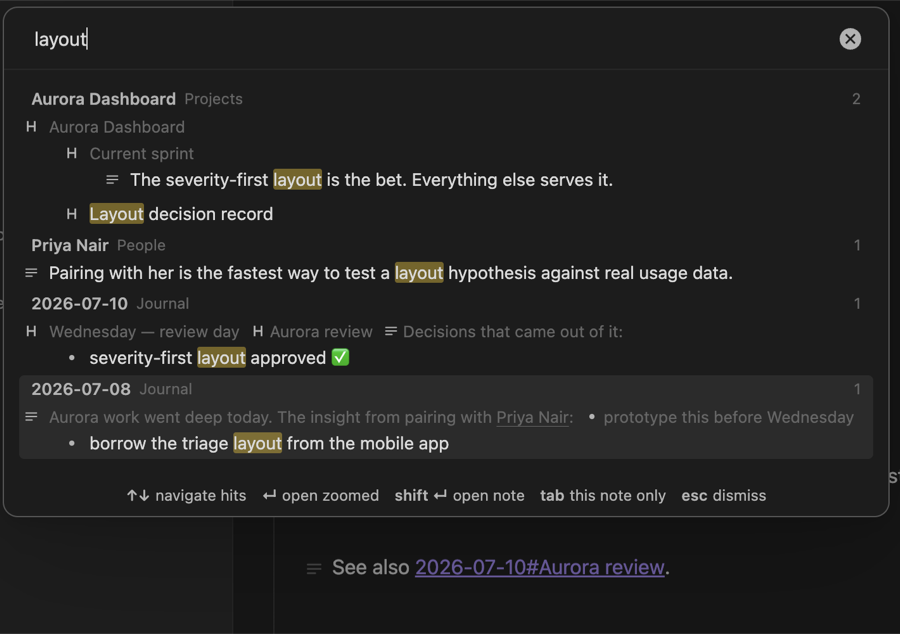
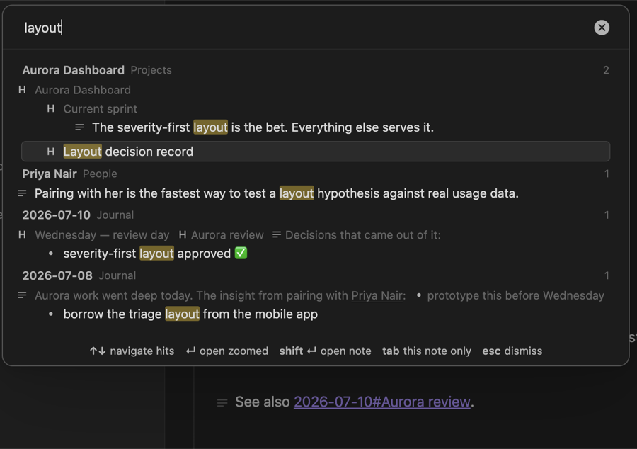
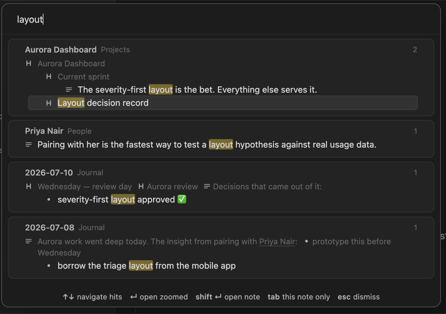
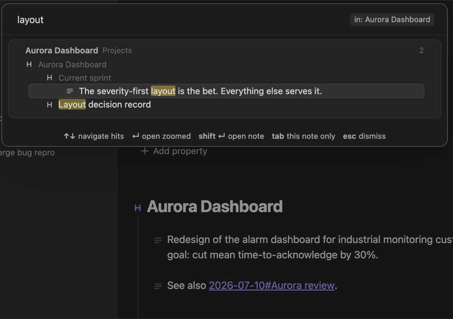
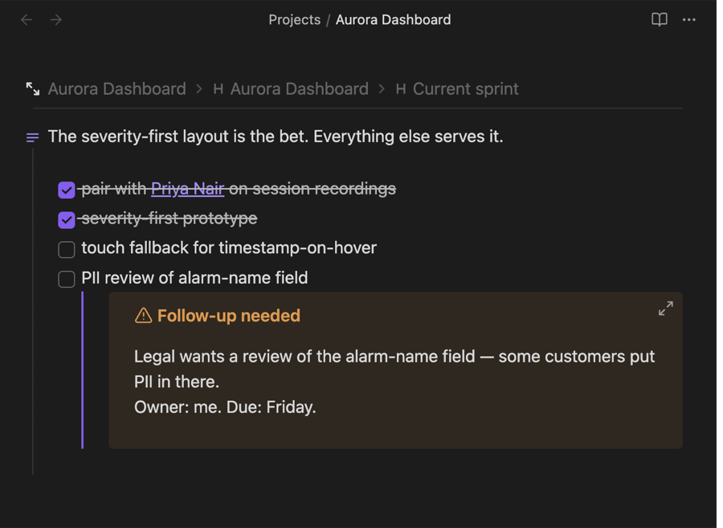

# Search: what the native UI permits, the surfaces we can own, and the palette prototype

Researched 2026-09-10 and 2026-09-11, before any search change exists. The question that
started it: the backlinks footer already renders references as structured, lineage-aware rows —
can the same view be given to in-file and vault-wide search, and how tightly can Obsidian's own
search UI be reused for it rather than building a new surface?

The short answer is that the native components are closed boxes: we can open them, hand them a
query and read what they found, but not change what they show or borrow their engine. So search
is a set of surfaces we own, fed by one engine we own, and the rest of this note is about which
surfaces, in what order, and what a first cut needs.

Related: [18-structured-backlinks.md](18-structured-backlinks.md) (the footer's design, and D17,
which already names filtered search as the projection's second consumer),
[20-surfaces-and-embedding.md](20-surfaces-and-embedding.md) (what drawing the outline on a
second surface costs), [23-zoom-hiding-mechanism.md](23-zoom-hiding-mechanism.md) (the hiding
mechanism an in-note filter would reuse).

## What the feature is

Three things that share one idea — "show me the nodes that match, in their tree":

1. **Filtering the backlinks footer by content**, not only by source note name as it does today.
2. **Searching across the vault** with results shown the way the footer shows references —
   grouped by note, each hit under its squashed ancestor chain — and a way to pick a hit and land
   on it, zoomed.
3. **Filtering the current note's outline** by a query: matches and their ancestors stay,
   everything else hides.

No query engine in the first cut. Plain text matching, with fuzziness and operators as later
layers.

## What Obsidian's native search components permit

Verified against `obsidian.d.ts` 1.13.1, the 1.13.7 application bundle, the community
`obsidian-typings` package, and the sources of the plugins named below. Each native component
has three layers — an engine that finds matches, a view that lists them, and hooks other code can
attach to — and the layers differ in what they expose.

| Component | Public | Private but stable, used by many plugins | Only by patching prototypes |
| --- | --- | --- | --- |
| Global search pane (core `global-search`, view type `search`) | Open it with a query through the `obsidian://search?query=` URI. The matching helpers `prepareFuzzySearch`, `prepareSimpleSearch`, `renderMatches`, `sortSearchResults`. | `internalPlugins.getEnabledPluginById('global-search').instance.openGlobalSearch(q)`; `leaf.setViewState({type:'search', state:{query}})`; reading `view.dom.resultDomLookup` and `vChildren`; a `MutationObserver` on the results container; the one event that exists, `search:results-menu`. | Changing how a result is drawn (`ResultDom.addResult`, `ResultDomItem.renderContentMatches`); being told when results change — there is no such event; running its engine ourselves. |
| In-file find (Cmd+F) | `MarkdownView.showSearch(replace?)` opens it. | `editor.editorComponent.search.hide()`. | Anything else. It is Obsidian's own component, not `@codemirror/search`'s panel; it highlights matches and exposes no hooks. |
| Quick Switcher (Cmd+O) | Nothing. | Subclassing its internal modal via `internalPlugins`, as Quick Switcher++ does. | Adding result types. |

Three facts settle the "how tightly" question:

- **The native engine is not fuzzy, and it is private.** It is an operator parser (`path:`,
  `tag:`, `line:()`, `/regex/`, `"exact"`). Even a hijacked pane would still run our own
  matching; we would be borrowing a shell around a different engine.
- **Re-rendering the pane means patching prototypes.** That is what Better Search Views does
  (`monkey-around` on `Component.addChild`, `ResultDom.addResult`,
  `ResultDomItem.renderContentMatches`), and it has been broken since Obsidian 1.12.4 with the fix
  unmerged and no release since December 2024. Doc 18 already recorded the pattern: everyone who
  patches core panes breaks, everyone who renders their own view survives. Core Search Assistant
  survives precisely because it only observes the results container and calls the view's
  toggles.
- **The README promises no monkey-patching**, and doc 20 already treats that as a product
  decision rather than a matter of taste. The private-but-stable column is borderline against it;
  the public column is only "hand off a query".

What a plugin does get for free is the LOOK: `SuggestModal` is the public base class of the
Quick Switcher, and `Modal` plus Obsidian's own `prompt-*` classes reproduce the same shell, so a
palette can look native without touching anything private. The community policies and the
review bot's lint rules say nothing about `internalPlugins` or patching either way; reviewers
ask for typed access rather than `as any`, nothing more.

## Cost: the engine is not the risk

Measured with the plugin's own parser (`src/parse.ts`) on the test vault, and on a synthetic
corpus made by repeating it thirty times. Matching is a case-insensitive subsequence test over
each node's own lines, run twenty times and averaged.

| Corpus | Files | Nodes | Parse, warm | One fuzzy pass over every node |
| --- | --- | --- | --- | --- |
| test-vault | 149 | 1,767 | 4.4ms | 0.4ms |
| synthetic | 4,470 | 53,010 | 63ms | 12ms |

Parse runs at roughly 25µs per KB. Once a vault's trees are in the mtime-keyed
`SourceTreeCache` the backlinks index already keeps, a whole-vault query is tens of milliseconds
with no index of its own. The unmeasured half is the FIRST `cachedRead` sweep inside Obsidian on a
real vault — thousands of file reads before the cache is warm — and it has to be measured in the
application before the vault-wide surface is proposed, since the answer decides whether that
surface warms the cache on load, on first use, or progressively while results paint.

## What other apps do

Surveyed 2026-09-11: Workflowy, Dynalist, Logseq (file and DB versions), Roam, Tana, RemNote,
Obsidian core with Omnisearch, Quick Switcher++, Another Quick Switcher and Better Search Views,
Notion, Craft, Capacities, Anytype, Heptabase, Bear, Apple Notes, Reflect, Amplenote, Org-mode
with org-ql and consult, The Archive, Zettlr. Only the rows that shaped a decision are kept.

| App | Surface | Result shape | In-page filter | On select | Matching |
| --- | --- | --- | --- | --- | --- |
| Workflowy | One search box; scope is the current zoom | Not a list: the outline filters in place, ancestors kept, editable | It IS the filter, live | Click a bullet zooms as usual | Substring; `"exact"`, `-`, `OR`, `is:`, `has:`, and `A > B` for "under an ancestor matching A" |
| Dynalist | Per-document box; Cmd+Enter searches everywhere; Shift+Enter "flat" | Filtered outline with ancestors, or a flat list on demand | Same box | Opens document, focuses item | Substring; `"exact"`, `ancestor:`, `parent:`, dates |
| Logseq | Cmd+K modal; groups for pages, blocks, blocks on the current page, commands | Grouped list; block text plus page name, no ancestor path | The current-page group, a list rather than a filter | Enter opens page scrolled to the block; Shift+Enter to the sidebar; zoom-into-block is an open request | Fuzzy |
| Roam | Top search bar | Pages and blocks, "the path to each block" shown | None; browser find cannot see folded blocks | Enter opens; Shift+Enter to the sidebar | Substring, ranked |
| RemNote | Cmd+P; Cmd+F in the document has a Find / Filter toggle | Grouped; every result carries its breadcrumb; Tab on a result searches within its children | Filter mode hides non-matching bullets | Click navigates; Shift to the other pane | Word-prefix, explicitly not fuzzy |
| Tana | Cmd+K command line; `?` on a node makes a search node | Live query results embedded in the outline, editable references | Scope operators (`CHILD OF`, `DESCENDANT OF`) | Results are in place | Query language |
| Obsidian core | Search pane; Quick Switcher for files; Cmd+F find | Grouped by file, matching lines, no ancestry | None | Opens file, highlights | Operators, not fuzzy |
| Omnisearch | Modal; Tab hops from vault results into in-file results | Ranked excerpts with highlighted terms | In-file mode is a list | Enter opens and scrolls | BM25, typo-tolerant, `"exact"`, `-` |
| Better Search Views | Patches the native pane | Breadcrumbs of ancestor headings and list items, children of a matched item | — | Click line or crumb | Inherits core |
| Org-mode | `C-c /` sparse tree in the buffer | Folded buffer showing matches, their ancestor headlines, and the next headline so editing is not claustrophobic | It IS the filter | Point moves | Regexp; org-ql for queries |

Patterns that carry into our design:

1. **The in-place sparse tree is the outliner-native filter** (Workflowy, Dynalist, RemNote's
   Filter, Org). Org's two refinements are cheap: also reveal the node after the last match, and
   drop highlights on the first edit rather than freezing a stale filter.
2. **Palette search wins when it shows the path to a block** — Roam, RemNote, and the entire
   reason Better Search Views exists. Obsidian core's flat lines are the gap.
3. **Two granularities in one box**: Logseq's "blocks on the current page" group and
   Omnisearch's Tab hop give "vault → this note" in one keystroke without a second surface.
4. **Ancestor operators** — Dynalist's `ancestor:`, Workflowy's `A > B` — express "X under Y"
   in the query. Lineage is data we already compute, so they are cheap later.
5. **Open zoomed by default** for a block hit. Logseq lacking it is an open feature request.
6. **A predictable escape from fuzziness.** Quoted exact terms are universal; RemNote refuses
   fuzzy matching outright; Amplenote's own docs call its fuzzy full-text "noisier".

Anti-patterns observed: a select action that only highlights and goes nowhere (Logseq's in-page
search); flat line lists that lose the path; a filter that cannot see into folded content; and
operators that silently differ between the global and the local surface.

Palette-style search UIs follow the WAI-ARIA combobox-and-listbox pattern: the input carries
`role="combobox"` with `aria-activedescendant` naming the active option, the list is a
`listbox` of `option`s, focus never leaves the input. Whether `SuggestModal` sets these roles
was not confirmed.

## The surfaces we can own

| Option | What it is | Reference | Public API it needs | Cost |
| --- | --- | --- | --- | --- |
| A. Footer filter | Fuzzy or plain match over the content the backlinks footer shows | Roam's linked-references filter | Already built; one spec requirement flips | Low |
| B. Palette | Cmd+K box: type, see structured hits, pick one, land zoomed; vault-wide and this-note in one box | Logseq, RemNote, Omnisearch | `Modal` or `SuggestModal` | Low to medium |
| C. In-note filter | Sparse tree over the open note, live, editable | Workflowy, Dynalist, Org | Zoom's block-replace hiding, a CodeMirror panel, mark decorations | Medium; one open design question |
| D. Sidebar view | The palette's results as a persistent pane | Obsidian core pane, Logseq "open in sidebar" | `registerView` plus the footer's renderer extracted | Medium to high |
| E. Live query block | A node whose children are search results | Tana search nodes, RemNote portals | Would need mirrors (doc 20, surface 4) | Deferred with mirrors |
| F. Native hand-off | Send our query to the core pane for its operators | — | The `obsidian://search` URI | Trivial, one-directional |

**Decided order: A, B, C, then D.** A is the lowest-hanging fruit. B has the highest value for
navigation and search, and gives both the broad and the narrow scope. C is a nice-to-have on
top of zoom, whose hiding mechanism it reuses — though "multiple visible lineages" is new to it.
D is lowest priority and pairs with the long-deferred backlinks sidebar pane: both are the same
grouped lineage list in an `ItemView`. F is a possible v1 command; nothing else touches the
native views unless the README's promise is revisited.

Palette and sidebar are the same content with different lifetimes. The palette is transient and
answers "take me there"; the sidebar persists and answers "let me browse these while I work".

## The palette prototype

Two shells were built in real Obsidian to compare `SuggestModal` against a custom `Modal`,
behind three `Prototype:` commands, with the simplest engine that gives real results: a
case-insensitive substring test over each node's own lines, across every markdown file, through
the same `SourceTreeCache` the footer uses. Results are grouped per note and rendered with the
footer's own row renderer — group head, squashed muted lineage rows, indented hits, the match
wrapped in `<mark>` — minus children and folding, which the palette does not want. Keys: arrows
move between hits, Enter opens the hit zoomed, Shift+Enter opens the whole note, Cmd+Enter a new
tab, Tab toggles "this note only"; the custom shell adds Cmd+Up/Down between groups. Opening
zoomed is a composition of code that already exists — the footer's open-and-reveal, then the
`zoomTo` effect `main.ts` dispatches for its own zoom command.

The source, its styles, the command block, the capture spec and the screenshots are under
[prototypes/search-palette/](prototypes/search-palette/). It is not wired into the build; to run
it again, copy the module into `src/plugin/`, the command block into `TrueOutlinerPlugin.onload`
and the CSS to the end of `styles.css`, then `npm run vault:install`.

Captured with the query `layout` and one ArrowDown, open on `Projects/Aurora Dashboard.md`:

| | |
| --- | --- |
|  |  |
| `SuggestModal`: the item is the unit of selection, so the group head and lineage rows drawn inside the hit's item take the selection band | The same with a few CSS rules moving the band onto the hit row |
|  |  |
| Custom `Modal`: group cards as in the footer, the hit alone highlighted | After Tab: a scope chip, results narrowed to the open note |
|  | |
| After Enter: the note opens zoomed to the hit, with the trail | |

### SuggestModal versus Modal

Both are fully public. The difference is who owns the result list.

**`SuggestModal`** owns it. It takes a flat array of items and one render function per item, and
gives the input, the switcher's styling, keyboard navigation, scrolling, hover, mouse selection,
the instructions footer and mobile behaviour for free. The cost is that the item is the unit of
everything: a group head and the lineage rows leading to a hit have to be drawn inside that hit's
item, which is why the selection band covers them in the first capture. CSS moves the band; it
cannot change the model — no group cards, no group-level navigation, no unfolding a hit's
children in place later, and the list rebuilds on every keystroke.

**`Modal`** gives an empty box. The prototype reproduces the switcher's shell from Obsidian's own
`prompt`, `prompt-input-container`, `prompt-results` and `prompt-instructions` classes, draws
group cards exactly as the footer does, highlights only the hit, and implements the keys through
the modal's `Scope`. That cost about 120 lines. In return everything is ours: group jumps, the
scope chip, ARIA roles, and the renderer can later mount unchanged in a sidebar view.

**Decided: the custom `Modal`.** The visual gap to a restyled `SuggestModal` is small today, but
every direction the palette wants to grow — children unfolding, group navigation, sidebar reuse,
operators shown as chips — fights the flat-item model. `SuggestModal` stays the fallback if the
fastest possible first ship ever matters more.

### What the prototype surfaced

- **The first lineage row repeats the note name** when a note opens with a matching H1 ("Aurora
  Dashboard", then the H1 "Aurora Dashboard"). The footer does the same. Worth suppressing when
  the two are identical.
- **Zooming into a leaf hit** shows one line and nothing else. Zooming to the hit's parent when
  the hit has no children may be the better default; the trail still names the hit's place.
- **Ordering** is by modification time in the prototype, a placeholder. Ranking is a later
  feature, but the default order is part of the first design.
- **Long lineage rows wrap** rather than truncate. Probably right, and a paragraph ancestor can
  take a whole line (the `2026-07-08` group above).
- **Selection wraps** at both ends in both shells. Fine for a short list; a long one wants a stop.
- **A vault-wide substring query over 149 notes was instantaneous**, as the measurements
  predicted; the prototype searched every file on every keystroke with no debounce and a
  generation counter to drop stale results.

## Engine: plain text first

Full-text matching before fuzziness, then the surfaces, then more features. The engine of the
first cut is therefore a pure function over the parsed tree — `(doc, query) → the ids of matching
nodes` — with a case-insensitive substring test per node over the node's own lines. Fuzziness
later is a swap of that predicate; the vault-wide and in-note surfaces do not care which one
runs.

Two things to settle before fuzziness arrives, recorded so they are not settled by accident:

- **Subsequence fuzzy over a whole paragraph is nearly vacuous.** A short query matches most long
  nodes. `prepareFuzzySearch` is built for titles and commands; per-word fuzziness, first-line
  matching, or score ranking with a cap have to be compared before the semantics enter a spec.
- **One grammar across surfaces.** The footer filter, the palette and the in-note filter must
  agree on what a query means; the survey's anti-pattern list has the cost of not doing so.

## Plan: changes, dependencies, stacking

Four changes. The dependency test from `AGENTS.md` — overlapping files, or code that reads what
the other branch adds — decides which are stacked.

**Change A — `search-hits-and-footer-content-filter`.** Off `main`.

- A pure matcher in the mapping core, beside `project.ts`: `matchNodes(doc, query)`, substring
  per node over its own lines, with a quoted-term-is-exact rule reserved but unimplemented.
- The footer's row model generalised from "a reference" to "a hit": `buildRows`' reference
  vocabulary becomes a hit marker with an optional backlink kind, so a search backend and the
  backlink index can feed the same rows.
- The footer's free-text field matches the CONTENT the footer shows — lineage segments, the hit
  node, its one level of children — instead of source note names only. This moves the term
  filter from before placement to after it and before the cap, so every admitted source is placed
  before the term applies; S5 measured placement at about 2ms for a hub note, so this is a spec
  change, not a cost problem. The `backlink-filtering` requirement "Search does not reach
  reference content" flips. Matches render with `<mark>`, as in the prototype.
- Files: `src/search.ts` (new), `footer-model.ts`, `footer-filter.ts`, `backlinks-footer.ts`,
  `styles.css`, the `backlink-filtering` spec.

**Change B — `search-palette`.** Stacked on A: it reads the matcher and the hit model A adds,
and its renderer extraction rewrites `backlinks-footer.ts`, which A also touches. The two are one
unit of work — "search v1" — which is what a two-layer stack is for.

- The custom `Modal` shell from the prototype, designed for real: vault-wide and this-note in
  one box with a Tab-toggled scope chip; group cards; hit-only selection; arrows between hits,
  Cmd+arrows between groups; Enter zoomed, Shift+Enter whole note, Cmd+Enter new tab; an
  instructions row; the combobox/listbox roles.
- The grouped-lineage-list renderer extracted from `FooterController` into a module both the
  footer and the palette call (`renderRow`, the marker helpers, the group head), so a row is
  drawn by one function on both surfaces. Doc 20's warning stands: the CHROME contract is
  shared, the content rules per surface are not.
- Results paint progressively per note, with a generation guard, and a cap with an honest count
  in the footer's own vocabulary (D10).
- The default order, the leaf-hit zoom rule, the H1-equals-note-name rule, and the phone
  presentation (a `Modal` on a phone is a full-screen sheet) are design decisions, not details.
- The one measurement it needs first: the cold `cachedRead` sweep on a large vault, in the
  application.
- Files: `src/plugin/search-palette.ts` (new), `src/plugin/lineage-list.ts` (new, extracted),
  `backlinks-footer.ts`, `main.ts`, `styles.css`, a new `search-palette` spec.

**Change C — `in-note-outline-filter`.** Off `main`, after A has merged and after the zoom
branches in flight have landed (`feat/zoom-boundary-edits`,
`fix/positions-re-base-with-the-zoom`, on the `feat/better-folding-ux` stack): it shares
`zoom-scope.ts` and `zoom-decorations.ts` with them, and stacking across a stack that is
about to move pays every restack for nothing.

- A panel over the editor with a query field; matches and their ancestors visible, everything
  else hidden through zoom's block-replace mechanism (doc 23); matches marked with a mark
  decoration; the node after the last match revealed (Org's rule).
- The open design question, to spike before proposing: editing while filtered. A node edited out
  of the match set would vanish under the caret. Freezing the hit set until the query changes is
  the safe default; Org's "highlights vanish on the first edit" is the alternative.
- "Multiple visible lineages" is new to zoom's machinery, which today hides everything outside
  ONE subtree; the projection function already computes the union, so the work is in the
  decoration builder and in the confinement rules of `zoom-edit-confinement`.

**Change D — `search-sidebar-view`.** Off `main`, after B. The palette's renderer in an
`ItemView`, and the natural home for the backlinks sidebar pane deferred since D1 in doc 18; the
two are one surface with two data sources. Not planned further here.

**Later layers**, in no committed order, parked here rather than in new changes: fuzziness with
quoted exact terms and `-` exclusion; an ancestor operator (`A > B`); ranking; unfolding a hit's
children in the palette; RemNote's Tab-to-descend into a hit's subtree; the `obsidian://search`
hand-off command for anyone who wants core's operators.

## Open questions

1. **The cold sweep.** How long does the first whole-vault `cachedRead` take inside Obsidian on a
   vault of a few thousand notes, and should the palette warm the tree cache at load, at first
   open, or progressively while painting? Decides B's first-paint design.
2. **Fuzzy semantics over long nodes.** Per-word, first-line, or scored-and-capped. Decides the
   later engine layer, and the spec wording for A's quoted-term rule.
3. **Editing under a filter.** Frozen hit set, or Org's drop-on-edit. Decides C.
4. **Whether the palette's "this note" scope and the in-note filter are one feature seen from two
   surfaces**, with the palette's scoped mode simply a list view of C's sparse tree. The survey
   suggests users want both forms (Dynalist's flat toggle); the code should not pay twice.
